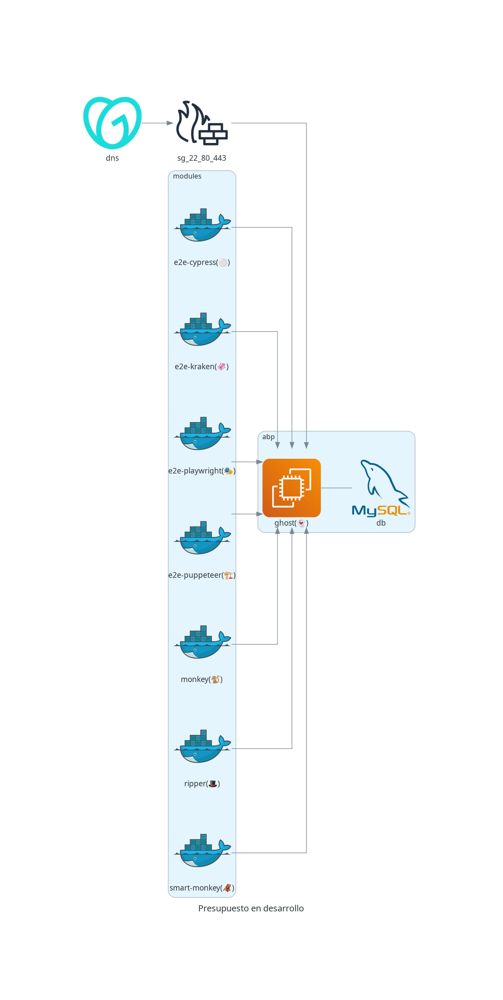

# Diseñar una estrategia de pruebas para la plataforma GHOST

## i. Integrantes

| Nombre completo             | Correo Uniandes                 |
| --------------------------- | ------------------------------- |
| Juan Manuel González Garzón | jm.gonzalez1844@uniandes.edu.co |
| Daniel Felipe Urrego        | d.urregor@uniandes.edu.co       |
| Daniel Sierra               | dani-sie@uniandes.edu.co        |
| Helberth Leonardo Monroy Bustos| h.monroy@uniandes.edu.co     |

Dado que se tiene una aplicacion bajo pruebas corriendo en la url: [http://ghost.appbajopruebas.com](http://ghost.appbajopruebas.com)

Y que ademas se cuenta con contenedores que guardan una suite de pruebas para ambas herramientas.

- [ghcr.io/juanmanuelgg/ghost/e2e-kraken:1.0.0](https://github.com/juanmanuelgg/ghost/pkgs/container/ghost%2Fe2e-kraken/212289275?tag=1.0.0)
- [ghcr.io/juanmanuelgg/ghost/e2e-playwright:1.0.0](https://github.com/juanmanuelgg/ghost/pkgs/container/ghost%2Fe2e-playwright/212288705?tag=1.0.0)

Se explicara como se puede hacer uso rapido de dichos contenedores y donde se reportan los resultados de las pruebas.



## ii. Paso a paso para la instalación y ejecución de las pruebas en Kraken

```shell
cd project
docker compose -f docker-compose-prod.yml up e2e-kraken --build
```

### iii. Paso a paso para la instalación y ejecución de las pruebas en la otra herramienta de su elección (**Playwright**)

```shell
cd project
docker compose -f docker-compose-prod.yml up e2e-playwright --build
```
